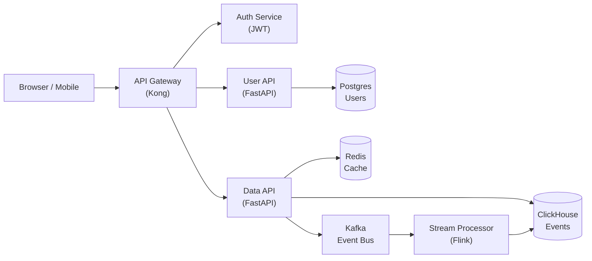
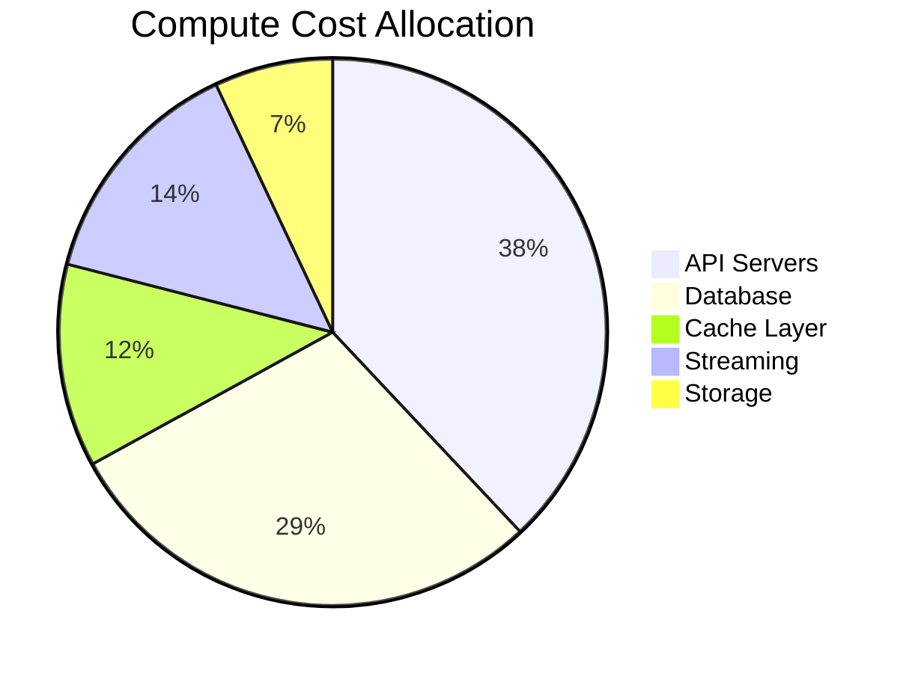
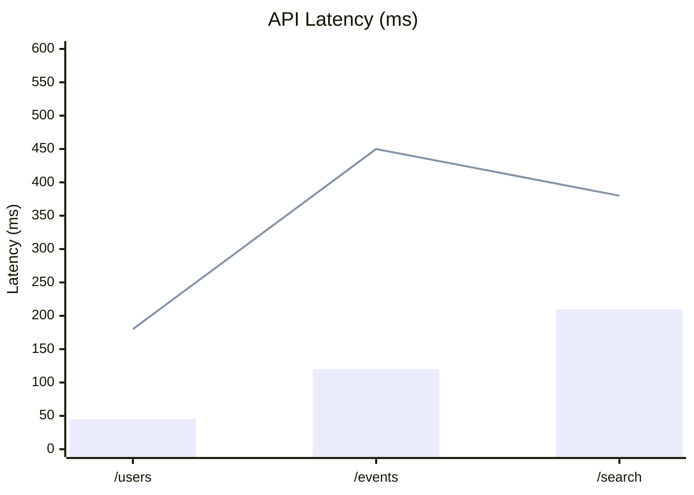
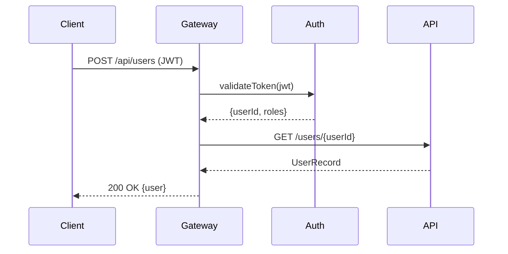
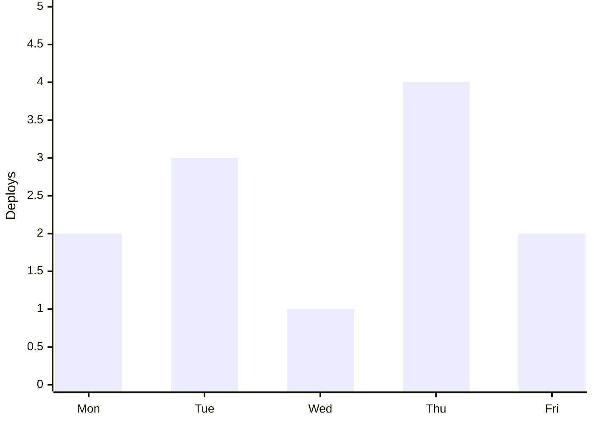

# Vesper
## A Technical Slidev Theme


<!--
Welcome to Vesper — a Slidev theme built for technical presentations. The design draws from structured documentation traditions: ruled frames, corner brackets, systematic typography, and a layout system that scales from a single slide to a full deck.

Vesper ships with 26 layouts, 7 components, and a dual-mode palette built on Catppuccin Mocha (dark) and Catppuccin Latte (light). Let's walk through what it can do.
-->

---
layout: table-of-contents
sectionNumber: TOC
title: TABLE OF CONTENTS
hideInToc: true
columns: 2
---
<!--
The table-of-contents layout is generated automatically from slide titles. Use `hideInToc: true` to exclude utility slides, and `level:` frontmatter if you need explicit hierarchy.
-->

---
layout: section
sectionNumber: '1'
descriptor: 'Typography, color tokens, and the CSS custom property system that drives every layout in the theme.'
---
# Chapter 1
## Design System


<!--
The section divider layout creates a structural pause between chapters. Bold display type, a short descriptor, and a thick accent rule — intentionally minimal so the audience registers a transition without reading anything.
-->

---
layout: default
title: 1-1. TYPOGRAPHY & COLOR
sectionNumber: 1-1
---
## 1-1. Typography & Color

Vesper uses **IBM Plex Sans** for all non-monospaced text and **Fira Code** for code, labels, and headers. Both are available from Google Fonts.

**Color system.** All visual values flow from CSS custom properties declared in `styles/index.css`:

| Token | Light (Latte) | Dark (Mocha) | Role |
|---|---|---|---|
| `--color-bg` | `#eff1f5` | `#1e1e2e` | Slide background |
| `--color-fg` | `#4c4f69` | `#cdd6f4` | Primary text |
| `--color-accent` | `#8839ef` | `#cba6f7` | Mauve — primary accent |
| `--color-accent-alt` | `#1e66f5` | `#89b4fa` | Blue — secondary accent |
| `--color-rule` | `#8c8fa1` | `#7f849c` | Dividing rules |

Toggle dark/light mode with the `d` key during a presentation.

<!--
The default layout is the primary workhorse of the theme. Everything in the content area is plain Markdown — no custom HTML required. Tables, lists, headings, and bold text all render with consistent typographic treatment automatically.
-->

---
layout: default
title: 1-2. LAYOUT ANATOMY
sectionNumber: 1-2
---
## 1-2. Layout Anatomy

Every layout follows the same three-zone structure:

1. **VesperHeader** — flex-shrink: 0; shows deck title · slide title · author
2. **Content area** — flex: 1, overflow hidden; layout-specific content
3. **VesperFooter** — flex-shrink: 0; shows section number · date · page/total

The `.slidev-layout` root is always `display: flex; flex-direction: column` at **960 × 540 px** (16:9, renders at 1920 × 1080 at 2×).

**Front matter drives the header/footer.** Set these once in the global front matter block and they propagate everywhere:

```yaml
title: 'Deck Title'     # → VesperHeader left
author: 'Your Name'     # → VesperHeader right
date: 'MONTH YEAR'      # → VesperFooter center
```

Per-slide overrides: add `title:` to any slide's front matter to set the center slot.

<!--
Understanding the three-zone structure makes it easy to reason about vertical space on any slide. The header and footer are fixed-height; all available height flows to the content area between them.
-->

---
layout: default
title: 1-3. DESIGN TOKENS & SVG DIAGRAMS
sectionNumber: 1-3
---
All palette values live as **`--vp-*` CSS custom properties** (Catppuccin Latte in light mode, Mocha in dark). Never hardcode hex values.

| Token | Role | Token | Role |
|---|---|---|---|
| `--vp-base` | Slide background | `--vp-text` | Body text |
| `--vp-surface0` | Panel / node fill | `--vp-overlay1` | Muted / subtext |
| `--vp-surface1` | Raised surface | `--vp-mauve` | Primary accent |
| `--vp-surface2` | Border / divider | `--vp-blue` | Secondary accent |
| `--vp-mantle` | Deep background | `--vp-teal` · `--vp-green` | Success / positive |
| `--vp-overlay0` | Subtle stroke | `--vp-red` · `--vp-yellow` | Error / warning |

**SVG diagrams** — use `var(--vp-*)` in `fill`/`stroke` attributes and set `image: ./path/to/diagram.svg` in image layout frontmatter. SVGs render inline by default so CSS vars resolve and they respond to dark/light mode. Use `imageMode: img` when an SVG should render as a plain image.

---
layout: section
sectionNumber: '2'
descriptor: 'Six image layout variants: right, left, full-bleed, top, bottom, and two-up.'
---
# Chapter 2
## Media Layouts


---
layout: image-right
title: 2-1. IMAGE RIGHT
sectionNumber: 2-1
figNumber: 2-1
figLabel: COMPONENT ARCHITECTURE — DEPENDENCY GRAPH
image: './assets/fig_1-1.svg'
---
## 2-1. Image Right

The **image-right** layout places a text column on the left and an image panel on the right. The figure caption (`figNumber` + `figLabel` front matter) renders automatically below the image.

Use this layout when the text is the primary content and the image is supporting evidence — a diagram that illustrates a point already made in prose.

**When to use:**
- Architecture diagrams alongside explanation
- Screenshots of UI with annotated walkthrough
- Reference photos with descriptive text


<!--
The image panel fills the right half of the content area; the figure caption renders in standardized label style below it. Swap to image-left by changing a single word in the front matter.
-->

---
layout: image-left
title: 2-2. IMAGE LEFT
sectionNumber: 2-2
figNumber: 2-2
figLabel: DEPLOYMENT PIPELINE — STAGE DIAGRAM
image: './assets/fig_1-2.svg'
---
## 2-2. Image Left

The **image-left** layout mirrors image-right. Choose between the two based on the visual composition of your image — or to vary the rhythm of a deck that uses many image slides in sequence.

Both variants share the same front matter props:
- `figNumber` — rendered as `FIG. X` in the caption
- `figLabel` — the descriptive label following the em dash

**Tip.** Leave `figNumber` and `figLabel` out of the front matter entirely to suppress the caption. The image fills the panel without any label below it.


<!--
The mirror layout. Change `image-left` to `image-right` in front matter to flip — everything else stays the same.
-->

---
layout: image-full
title: 2-3. IMAGE FULL
sectionNumber: 2-3
bannerText: VESPER THEME — LAYOUT SHOWCASE
image: './assets/fig_1-full.svg'
subtitle: 'Every element earns its place. Nothing decorates; everything communicates.'
---


# Structure Without Noise


<!--
The image-full layout strips away all structural chrome — no header, footer, or section numbers. A gradient ensures the text block at the bottom is always legible regardless of what the image contains. Use it as punctuation: a visual transition between major sections, or a dramatic context-setting moment before a dense content run.

The optional `bannerText` prop adds a label bar at the top — useful for persistent deck identity or section labels.
-->

---
layout: image-top
title: 2-4. IMAGE TOP
sectionNumber: 2-4
figNumber: 2-3
figLabel: SYSTEM MONITORING DASHBOARD — LIVE VIEW
image: './assets/fig_1-3.svg'
---
The **image-top** layout places a photograph or diagram in a horizontal band across the upper portion of the slide, with the content area below. The figure caption sits between the image and the text.

This layout works well when the visual **establishes the subject** and the text provides the analysis. The natural reading direction moves image → caption → content.

- Use for dashboards and UI screenshots with explanatory notes below
- Effective for before/after comparisons when one image suffices
- The image band height is fixed; resize images to fill the band proportionally


<!--
Image-top is the natural layout when the visual is the premise and the text is the conclusion. Eye tracking moves top-to-bottom: see it, understand it, read the analysis.
-->

---
layout: image-bottom
title: 2-5. IMAGE BOTTOM
hideInToc: true
sectionNumber: 2-5
figNumber: 2-4
figLabel: DATA PIPELINE — END-TO-END FLOW
image: './assets/fig_1-4.svg'
---
## 2-5. Image Bottom

The **image-bottom** layout inverts image-top, placing the content area above and the image below. Use it when the argument needs to come first and the image is the visual conclusion — the evidence that lands at the end of the slide.

**Effective for:**
- Process diagrams that confirm a stated conclusion
- Results screenshots following a hypothesis


<!--
Where image-top says "here's the context, now the explanation" — image-bottom says "here's the argument, now the proof." The layout mirrors the rhetorical move.
-->

---
layout: two-images
title: 2-6. TWO IMAGES
hideInToc: true
sectionNumber: 2-6
fig1Number: 2-5
fig1Label: BEFORE — DEFAULT THEME
fig2Number: 2-6
fig2Label: AFTER — VESPER TREATMENT
image1: './assets/fig_1-5.svg'
image1Mode: 'img'
image2: './assets/fig_1-6.svg'
---
The **two-images** layout places two image panels side by side, each with an independent figure caption. A shared text area above both panels frames the comparison.

Natural uses: before/after comparisons, paired screenshots, or two reference diagrams that need to be seen together simultaneously.


<!--
Both figure captions are independently labeled, so each is individually citable in body text. The layout renders them at equal width with a consistent gap between them.
-->

---
layout: section
sectionNumber: '3'
descriptor: 'Columns, statement, quote, callout boxes, and side-by-side comparison panels.'
---
# Chapter 3
## Content Layouts


---
layout: statement
hideInToc: true
---
"Good design is as little design as possible."

<!--
The statement layout presents a single piece of text in large display type, centered on the slide. No header, footer, or section numbers — the content is the entire message. Use it sparingly; the impact comes from contrast with the content-dense slides around it.
-->

---
layout: default
title: 3-1. SLIDE DISCIPLINE
sectionNumber: 3-1
---
## 3-1. Slide Discipline

The **one-idea principle**: each slide communicates exactly one primary idea. Supporting points clarify or expand it — they don't introduce new ones.

**Practical limits for this theme at 960 × 540:**

- Body text: 16–18px baseline for comfortable reading at distance
- Bullet lists: 5–6 items maximum before cognitive load spikes
- Tables: 5 columns maximum; use `th` styling for column headers
- Code blocks inline: ~20 lines maximum before scrolling occurs

**When a slide feels crowded, it's a signal.** Split into two slides, not a smaller font. The `two-column` and `three-column` layouts exist for dense parallel content that must stay on one slide.

<!--
The default layout handles prose, bullet lists, and tables equally well. All spacing is driven by CSS custom properties so the vertical rhythm stays consistent as content varies.
-->

---
layout: two-column
title: 3-2. TWO COLUMNS
sectionNumber: 3-2
---
::left::

## SYNCHRONOUS

- Request/response cycle
- Caller blocks until result
- Simple error handling
- Tight coupling between services
- Easy to reason about locally
- Harder to scale independently

**Best for:** CRUD APIs, user-facing reads, transactional writes


::right::

## ASYNCHRONOUS

- Message queue or event bus
- Caller continues immediately
- Failure isolation at the boundary
- Loose coupling between services
- Harder to trace end-to-end
- Scales each side independently

**Best for:** Notifications, background jobs, cross-domain events


<!--
The two-column layout splits the content area into two equal columns with a dividing rule between them. Each column accepts any Markdown: bullets, prose, headings, tables. Use it for genuinely parallel content where seeing both columns simultaneously is the point. For deliberate point-counterpoint with visual emphasis, the comparison layout is the better fit.
-->

---
layout: three-column
title: 3-3. THREE COLUMNS
sectionNumber: 3-3
col1Header: INGESTION
col2Header: PROCESSING
col3Header: DELIVERY
---
::left::

- Kafka topic per source
- Schema registry validation
- Queue on parse failure
- Backpressure at the connector
- Retention: 7 days

:::block{type="info" title="DIGESTION" compact=true}

Rather "Kafka-esque"

:::


::center::

- Flink streaming job
- Windowed aggregations (5 min)
- Deduplication by event ID
- State store: RocksDB
- Checkpoint interval: 60s

:::block{type="success" title="PROGRESSING" compact=true}

Always moving forward

:::


::right::

- Write to ClickHouse cluster
- Real-time materialized views
- Grafana dashboard refresh: 30s
- Alerting via PagerDuty
- SLA: p99 < 2s end-to-end

:::block{type="warning" title="THE LIVERY" compact=true}

Wear it with pride

:::


<!--
Three columns is about the practical limit for this aspect ratio. Past that, line lengths get too short to read comfortably. Column headers are set in front matter; they render in a smaller monospace style to signal they're structural labels rather than content headings.
-->

---
layout: quote
attribution: Donald Knuth
rank: Professor Emeritus of The Art of Computer Programming
unit: Stanford University
---
"Programs are meant to be read by humans and only incidentally for computers to execute."

<!--
The quote layout presents a quotation in large display type with attribution below it. The attribution line handles name, title, and affiliation as separate front matter props. The distinction from the statement layout: here someone is being quoted; on statement you're making a direct assertion.
-->

---
layout: callout
title: 3-5. CALLOUT TYPES
sectionNumber: 3-5
calloutType: warning
calloutTitle: WARNING — DATA LOSS RISK
---
## 3-5. Callout Boxes

The callout layout adds a prominent alert box to the lower portion of the slide. Four severity levels with standardized visual treatment:

- **Warning** (red) — conditions that can cause data loss or security incidents
- **Caution** (amber/peach) — conditions requiring care; reversible if caught early
- **Note** (blue) — supplementary information worth calling out explicitly
- **Important** (mauve) — deserves attention but doesn't rise to warning level

::callout::

**Running `db:migrate:reset` in production drops all data.** This command is intended for development environments only. Verify your `DATABASE_URL` environment variable before running any destructive migration command. There is no undo — use `db:rollback` instead.


<!--
The callout box color treatment makes severity readable at a glance before the label is even read. The Callout component (coming up in the code chapter) lets you place any of these inline within regular slide content rather than locked to the bottom of the callout layout.
-->

---
layout: comparison
title: 3-6. COMPARISON LAYOUT
hideInToc: true
sectionNumber: 3-6
leftHeader: RELATIONAL — PostgreSQL
rightHeader: DOCUMENT — MongoDB
leftAccent: blue
rightAccent: teal
---
::left::

**Strengths:**
- Strong consistency guarantees (ACID)
- Mature tooling and ecosystem
- Complex joins across normalized tables
- Schema enforcement at write time
- Excellent for reporting and analytics

**Tradeoffs:**
- Schema migrations require planning
- Horizontal scaling adds operational overhead


::right::

**Strengths:**
- Flexible schema evolution
- Horizontal sharding built-in
- Developer ergonomics for nested data
- JSON-native; no ORM required for simple cases

**Tradeoffs:**
- Eventual consistency in distributed mode
- No multi-document transactions (pre-4.0)
- Joins require application-level logic


<!--
The comparison layout creates two labeled panels for deliberate point-counterpoint content. Each panel has its own header and accent color applied to its top border and label area — the color signals the relationship between the two options before a word is read. Accent options: red, blue, teal.
-->

---
layout: section
sectionNumber: '4'
descriptor: 'Code display layouts, Block, Callout, Columns, and CodeBlock components.'
---
# Chapter 4
## Code & Components


---
layout: code-full
title: 4-1. CODE FULL
sectionNumber: 4-1
codeTitle: STREAM PROCESSOR
codeLang: python
caption: 'SOURCE: stream_processor.py — 60-second tumbling window'
---
```python {1-5|6-14|15-22}
from dataclasses import dataclass
from typing import AsyncIterator
import asyncio

@dataclass
class Event:
    id: str
    topic: str
    payload: dict
    timestamp: float

async def process_stream(
    source: AsyncIterator[Event],
    sink: asyncio.Queue,
    *,
    window_seconds: int = 300,
) -> None:
    """Consume events and forward deduplicated records to sink."""
    seen: set[str] = set()
    async for event in source:
        if event.id not in seen:
            seen.add(event.id)
            await sink.put(event)
```


<!--
The code-full layout fills the entire content area with a single code panel. A prominent title bar shows the filename and language badge. Click-through highlighting uses Slidev's standard `{1-5|6-14|15-22}` syntax. The footer caption slot renders a source annotation at the bottom of the panel.
-->

---
layout: code-right
title: 4-2. CODE RIGHT
sectionNumber: 4-2
codeTitle: CONFIG LOADER
codeLang: typescript
---
## 4-2. Code Right

The **code-right** layout places explanatory prose on the left and a code panel on the right — the same split as the default layout, but with a fully-styled code panel replacing the right column.

**Use this layout when:**
- You need to explain a snippet line by line
- The code and the explanation are equally important
- The snippet is too long to embed inline on a default slide

The code panel includes corner brackets, a title bar, a language badge, and a caption slot — all styled to match the global code system in `styles/code.css`.

::code::

```typescript
interface Config {
  apiUrl: string
  timeout: number
  retries: number
  debug: boolean
}

function loadConfig(): Config {
  return {
    apiUrl: process.env.API_URL ?? 'http://localhost:8080',
    timeout: Number(process.env.TIMEOUT ?? 5000),
    retries: Number(process.env.RETRIES ?? 3),
    debug: process.env.DEBUG === 'true',
  }
}

export const config = loadConfig()
```

<!--
The code-right layout is the most common layout for step-by-step technical walkthroughs. The prose column can contain bullets, numbered steps, or regular prose — whatever explains the code on the right most effectively.
-->

---
layout: default
title: 4-3. BLOCK COMPONENT
sectionNumber: 4-3
---
## 4-3. Block Component

The `Block` component creates titled content panels with a solid accent header bar and corner brackets. Six type variants map to Catppuccin semantic colors:

:::block{type="info" title="INFO — API AUTHENTICATION"}

All requests to the `/api/v2/` endpoint require a bearer token in the `Authorization` header. Tokens expire after **24 hours** and must be refreshed via `POST /auth/refresh`. Rate limit: 1000 req/min per token.

:::

:::block{type="warning" title="WARNING — BREAKING CHANGE"}

The `user.permissions` field has changed from `string[]` to `Permission[]` in v3.0. Clients using the v2 response shape will receive a validation error. See the migration guide at `/docs/v3-migration`.

:::

:::block{type="success" title="SUCCESS — DEPLOYMENT VERIFIED"}

All 12 health checks passed. Zero-downtime deployment complete. Rollback window: 30 minutes. Monitor at `grafana.internal/d/api-latency`.

:::

<!--
The Block component is the inline version of the callout layout — it can appear anywhere on a slide, not just at the bottom. Use Block for structured callouts within regular content flow. The six types are: default (mauve), info (blue), success (green), warning (yellow), danger (red), example (teal).
-->

---
layout: default
title: 4-4. BLOCK VARIANTS 
sectionNumber: 4-4
---
## 4-4. Block Variants — Titled Types

:::block{type="default" title="DEFAULT"}

General-purpose note in the theme accent color (Mauve). Use for observations, cross-references, or supplementary context.

:::

:::block{type="info" title="INFO"}

Prerequisites, background reading, or contextual explanation. Blue accent.

:::

:::block{type="success" title="SUCCESS"}

Confirmation, passing criteria, or positive outcome. Green accent.

:::

:::block{type="warning" title="WARNING"}

Degraded state, caveat, or important constraint. Yellow accent.

:::

<!--
All six variants use the same component; only the `type` prop changes. The corner brackets on Block use the block's accent color, not the global bracket color.
-->

---
layout: default
title: 4-4. BLOCK VARIANTS 
hideInToc: true
sectionNumber: 4-4
---
## 4-4. Block Variants — Alert Types + Modifiers

:::block{type="danger" title="DANGER"}

Irreversible action or hard failure. Use for data loss, secret rotation, production drops. Red accent.

:::

:::block{type="example" title="EXAMPLE"}

Usage demonstration or runnable snippet. Teal accent.

:::

**Titleless** — omit `title` for a left-accent border with no header bar:

:::block{type="info"}

A titleless Block renders with a left accent border only — useful for inline asides without the visual weight of a full header bar.

:::

**Compact** —

:::block{type="example" title="EXAMPLE" compact=true}

Add `:compact="true"` to reduce body padding for dense contexts.

:::

<!--
The titleless variant is useful for advisory inline content that doesn't need the visual weight of the full header bar.
-->

---
layout: default
title: 4-5. CALLOUT COMPONENT
hideInToc: true
sectionNumber: 4-5
---
## 4-5. Callout Component

The `Callout` component is a different tool from `Block` — it's for inline alert notices in the body of a regular slide:

:::callout{type="note"}

**NOTE.** The `Callout` component uses a left border accent + tinted background, while `Block` uses a solid header bar. Use Callout for supplementary advisory notes inline in content; use Block for structured titled panels.

:::

:::callout{type="caution"}

**CAUTION.** Do not use `position: fixed` inside Slidev slide content — the slide container applies `transform: scale()` which creates a new stacking context and breaks fixed positioning.

:::

:::callout{type="important"}

**IMPORTANT.** The `setup/shiki.ts` file must export a bare function with no imports from `@slidev/types` or `@slidev/client`. Those packages are not installed in the theme directory. Slidev calls the export directly as `mod.default()`.

:::

<!--
Both Block and Callout exist because they serve different roles. Callout is advisory inline content; Block is a structured information panel with a strong header. Using both makes the visual hierarchy richer.
-->

---
layout: default
title: 4-6. COLUMNS COMPONENT
hideInToc: true
sectionNumber: 4-6
---
## 4-6. Columns Component

Use `:::columns` for an inline two- or three-column region inside any regular content slide. Separate columns with a standalone `+++` line.

:::columns
## LEFT

- Full Markdown support
- Nested Vesper components
- Equal-width columns

:::block{type="info" title="NESTED BLOCK" compact=true}

Works inside a column.

:::

+++

## RIGHT

:::callout{type="note"}

Use layout slot sugar for whole-slide columns; use `:::columns` for inline regions.

:::
:::

<!--
The Columns component is intentionally minimal: two or three equal-width columns inferred from the number of separators. The `+++` separator is only recognized inside `:::columns`, and code fences are ignored so examples remain safe.
-->

---
layout: default
title: 4-7. CODEBLOCK COMPONENT
hideInToc: true
sectionNumber: 4-7
---
## 4-7. CodeBlock Component

The `CodeBlock` component embeds a fully-styled code panel **inline** on any layout — border, header bar, corner brackets, and caption — without needing `code-right` or `code-full`.

**Props:** `title`, `lang`, `caption`

<CodeBlock title="API CLIENT" lang="typescript" caption="src/lib/api.ts">

```typescript
export async function fetchUser(id: string) {
  const res = await fetch(`/api/users/${id}`)
  if (!res.ok) throw new Error(res.statusText)
  return res.json() as Promise<User>
}
```

</CodeBlock>

<!--
The CodeBlock component is the standalone version of the code panel — same styling as code-right and code-full, but available on any layout. The border and header bar are applied via the component's own scoped CSS so they render correctly regardless of the parent layout.
-->

---
layout: section
sectionNumber: '5'
descriptor: 'Mermaid diagram layouts, a multi-panel dashboard, and a chronological timeline.'
---
# Chapter 5
## Charts, Data & Timeline


---
layout: chart-full
title: 5-1. CHART FULL — SYSTEM ARCHITECTURE
sectionNumber: 5-1
codeTitle: SERVICE DEPENDENCY MAP
---


<!--
The chart-full layout renders a Mermaid diagram in the full content area. The Mermaid theme variables in the global front matter drive the node and edge colors — they are set to Catppuccin Mocha here. The `codeTitle` prop adds a label bar above the diagram.
-->

---
layout: chart-right
title: 5-2. CHART RIGHT — COMPONENT BREAKDOWN
sectionNumber: 5-2
---
## 5-2. Chart Right

The **chart-right** layout places explanatory text on the left and a Mermaid diagram on the right — the same split as `code-right`, applied to charts.

**When to use chart-right:**
- When the diagram needs annotation that would be too verbose for a caption
- Flow diagrams where you want to narrate each step
- Architecture diagrams paired with a bullet summary

The diagram panel uses the same corner bracket and title bar system as the code panel, adjusted for diagram aspect ratios.

::chart::



<!--
Chart-right mirrors code-right structurally. The diagram area fills the right half; the left column accepts any Markdown content.
-->

---
layout: chart-left
title: 5-3. CHART LEFT — REQUEST LATENCY
sectionNumber: 5-3
---
## 5-3. Chart Left

The **chart-left** layout mirrors chart-right, placing the diagram on the left and explanatory text on the right.

Choose between the two based on visual composition — similar to the image-right vs. image-left decision.

**Reading the chart:** p50 latency is well within the 200ms SLA across all three endpoints. The `POST /events` endpoint shows elevated p99 due to Kafka acknowledgement wait time. A local buffer flush before acknowledgement would reduce this to under 400ms p99.

::chart::



<!--
Chart-left for when the diagram is the primary subject and the text is the annotation. The xyChart type works well here for quantitative comparisons — bar for p50, line for p99.
-->

---
layout: default
title: 5-4. INLINE MERMAID
sectionNumber: 5-4
---
## 5-4. Inline Mermaid

You can embed Mermaid diagrams directly in any layout using a fenced code block with the `mermaid` language tag. No special component or slot required.



Use `chart-full`, `chart-right`, or `chart-left` layouts when the diagram needs more space or an explanatory sidebar. Use inline for compact diagrams that fit naturally within a content slide.

<!--
Inline Mermaid is the simplest option — just write the fenced block in the slide content. The theme's Mermaid configuration in the global front matter applies to all diagrams regardless of how they're embedded.
-->

---
layout: dashboard
title: 5-5. DASHBOARD LAYOUT
hideInToc: true
sectionNumber: 5-5
panel1Label: 'API HEALTH'
panel2Label: 'LATENCY P99'
panel3Label: 'ERROR RATE'
panel4Label: 'DEPLOY FREQUENCY'
caption1: '30-DAY UPTIME'
caption2: 'SLA: < 200ms ✓'
caption3: '7-DAY AVERAGE'
caption4: 'WEEKLY DEPLOYS'
---
::panel1::

<div style="font-family: var(--font-mono); font-size: 3.2rem; font-weight: 900; color: var(--vp-green); text-align: center; padding: 1.2rem 0 0.4rem;">99.97%</div>


::panel2::

<div style="font-family: var(--font-mono); font-size: 3.2rem; font-weight: 900; color: var(--vp-yellow); text-align: center; padding: 1.2rem 0 0.4rem;">187ms</div>


::panel3::

<div style="font-family: var(--font-mono); font-size: 3.2rem; font-weight: 900; color: var(--vp-red); text-align: center; padding: 1.2rem 0 0.4rem;">0.03%</div>


::panel4::




<!--
The dashboard layout provides four independent panels in a 2×2 grid, each accepting any Markdown or component content. Use it for status overviews, KPI summaries, or any situation where multiple parallel data points need to be read simultaneously.
-->

---
layout: timeline
hideInToc: true
sectionNumber: 5-6
direction: horizontal
items:
  - date: WEEK 1
    title: Discovery
    description: Stakeholder interviews, system audit, API contracts, data model.
  - date: WEEK 2–3
    title: Infrastructure
    description: Kafka cluster, Flink scaffolding, ClickHouse schema, CI/CD pipeline.
  - date: WEEK 4–6
    title: Feature Dev
    description: Stream processor, API endpoints, Grafana dashboards, alerts.
  - date: WEEK 7
    title: Load Testing
    description: k6 tests to 10× volume. Tune Kafka partitions and Flink parallelism.
  - date: WEEK 8
    title: Staged Rollout
    description: 10% → 50% → 100% migration. 30-minute rollback window.
---
<!--
The timeline layout can render simple entries directly from frontmatter. For rich Markdown in an entry body, use the `:::timeline-entry{date="..." title="..."}` component sugar instead.
-->

---
layout: default
title: ALL CALLOUT TYPES — REFERENCE
hideInToc: true
sectionNumber: A-1
---
## Appendix A — Callout Reference

All four Callout types, side by side:

:::callout{type="warning"}

**WARNING.** The most serious level — conditions that can cause real harm. Red accent.

:::

:::callout{type="caution"}

**CAUTION.** Conditions requiring care; recoverable if caught early. Peach/amber accent.

:::

:::callout{type="note"}

**NOTE.** Supplementary information worth calling out explicitly. Blue accent.

:::

:::callout{type="important"}

**IMPORTANT.** Deserves attention but not alarming. Mauve accent.

:::

See image layout slides for `FigureCaption` usage (renders below the image with figure number and label).

<!--
Appendix slides work identically to regular content slides. Use the `sectionNumber` front matter to assign appendix numbering (A-1, A-2, etc.) — it flows through to the header and footer automatically.
-->

---
layout: default
title: CSS UTILITY CLASSES — REFERENCE
hideInToc: true
sectionNumber: A-2
---
## Appendix B — CSS Utilities

| Class | Description |
|---|---|
| `.vp-label` | Monospaced uppercase label style (used in headers, timeline dates) |
| `.vp-bracketed` | Adds corner brackets via `::before`/`::after` pseudo-elements |
| `.vp-bracket-bl` | Bottom-left corner bracket span |
| `.vp-bracket-br` | Bottom-right corner bracket span |
| `.vp-image-frame` | Adds a ruled frame with corner brackets around an image |
| `.vp-list` | Converts a `<ol>` to parenthesized list markers: (1), (2), (3) |
| `.vp-section-id` | Section number label style |

**Design tokens** — all layout CSS uses semantic vars (`--color-bg`, `--color-fg`, `--color-accent`, `--color-accent-alt`, `--color-rule`, `--color-rule-light`) rather than raw Catppuccin hex values, so both light and dark modes update automatically.

<!--
This reference slide documents the CSS utility classes available for use in slide content. Because Slidev auto-imports components but not utility classes, you apply these directly via `class=""` attributes on HTML elements in your markdown.
-->

---
layout: end
hideInToc: true
subtitle: VESPER THEME
bannerText: VESPER — CATPPUCCIN · IBM PLEX SANS · FIRA CODE
photo: https://github.com/lukemcguire.png
endTitle: 'Thank You'
contact: |
  github.com/lukemcguire/slidev-theme-vesper
  luke.mcguire@gmail.com
  Built with Slidev · Palette by Catppuccin
---


<!--
The end layout provides a formal closing slide with an optional presenter photo (cropped to a circle), contact information, and Banner labels at top and bottom for persistent deck identity. The photo is optional — omit the `photo` prop to remove it. The `bannerText` prop drives both Banner instances.
-->
